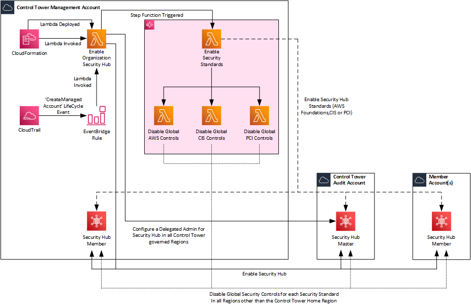

# AWS Security Hub

The CloudFormation Template and Lambda Function have been adapted from the original source on [GitHub](https://raw.githubusercontent.com/aws-samples/aws-control-tower-securityhub-enabler/main/aws-control-tower-securityhub-enabler.template) and the associated [blog post](https://aws.amazon.com/blogs/mt/automating-aws-security-hub-alerts-with-aws-control-tower-lifecycle-events/).

The reason I've adapted it is that I noticed a few things:
1.  Once deployed, it enables Security Hub in every AWS Region across all AWS Accounts in the Organisation. 
    * From my perspective, that could potentially add additional costs to the overarching bill.
    * There maybe situations where Clients restrict the AWS Regions that can be used within AWS e.g. through Service Control Policies. 
    * Control Tower may not have all AWS Regions governed by Control Tower meaning that effectively other AWS Best Practices may not be configured within those regions. In addition, following recent updates to Control Tower there are now Data Residency GuardRails that applies an SCP to only allow the use of governed regions except in the case where the AWS Service is global.
    * **Change Made:** The code has been tweaked to identify the Control Tower governed regions by listing the regions utilised from a Control Tower deployed CloudFormation StackSet which occurs on any Control Tower deployment.  This is in light of the fact that there is no API for Control Tower.  There is then a change in the codes logic to loop through all regions governed by Control Tower and if this is a supported region by Security Hub to then proceed as per the orginal code. 
    * **Change Made:** The `get_all_accounts` python function has been updated to only return AWS Accounts in the Organisation that have a status of 'ACTIVE'. Therefore any AWS Accounts that are in a suspended state pending deletion are ignored.
2.  Once deployed, Security Hub wasn't configured with a Delegated Admin or to auto-invite AWS Accounts within the Organisation.
    * **Change Made:** The `enable_security_hub_admin` python function has been updated to use the `enable_organization_admin_account` and `update_organization_configuration` boto3 API's to ensure that a Delegated Admin is configured and that Auto-Enable is also turned on
3.  If you try to delete the AWS CloudFormation Stack that is created following on from the enabling of a Delegated Admin then it would fail to disable Security Hub.
    * **Change Made:** The `disable_security_hub` python function has been updated to loop through all Members and deregister the Delegated Admin and then loop through all Active AWS Accounts and disabling Security Hub in all configured regions.
4.  Added the Capabiity for both newly created AWS Accounts through the Account Vending Maching component of Control Tower or existing AWS Accounts that have been joined to the AWS Organization and registered in Control Tower to have Security Hub enabled.
    * **Change Made:** Update to the CloudFormation Template to create an EventBridge Rule that is triggered based on a Control Tower LifeCycle Event `CreateManagedAccount`.

## Architecture Overview



## Pre-Requisites and Installation

### Pre-Requisites

There is an overarching assumption that you already have [Customisation for Control Tower](https://aws.amazon.com/solutions/implementations/customizations-for-aws-control-tower/) deployed within your Control Tower Environment.

1.  Clone the GitHub Repo to your local device.
2.  Create an S3 Bucket where you'll then upload the `securityhub.zip` file to. Make a note of the bucket name and the prefix to the `guarduty.zip`. Note: The region where you create the bucket will need to be in the region of the Control Tower home region since that is where the Lambda Function will be created.

### Installation

1.  Copy the CloudFormation Template `enable-securityhub.yaml` should be added to the `/templates` folder for use with Customisations for Control Tower.
2.  Copy the CloudFormation Parameters `enable-securityhub.json` should be added to `/parameters` folder for use with Customisations for Control Tower.
3.  Update the CloudFormation Parameters `enable-securityhub.json` with the required details:
    * **OrganizationId:** This is used to implement conditions within the IAM Policy used for the Lambda Execution Role. This can be obtained from with AWS Organisations.
    * **SecurityHubMasterAccountId:** This is the AWS Account ID of the Account that you wish to configure as the delegated admin for Security Hub.  It's recommended to use the Security Account (formerly called Audit Account) configured by Control Tower.
    * **S3SourceBucket:** This is the S3 Bucket where the Lambda Function source files are located. 
    * **S3Key:** This is the prefix within the S3 Bucket where the Lambda Function source files are located. 
    * **RoleToAssume:** This is used within the Lambda Function to AssumeRole into other AWS Accounts in order to Create/Configure/Delete different AWS Services such as Security Hub.  This is preconfigured with a default value of `AWSControlTowerExecution` since this IAM Role is created in all AWS Accounts as part the AWS Control Tower setup.
    * **EnableAWSFoundations:** This is used within the Lambda Function to specify whether or not the AWS Foundational Security Best Practices v1.0.0 Security Standard should be enabled or not. This is preconfigured to Yes to enable the standard. 
    * **EnableCISFoundations:** This is used within the Lambda Function to specify whether or not the CIS AWS Foundations Benchmark v1.2.0 Security Standard should be enabled or not. This is preconfigured to Yes to enable the standard.
    * **EnablePCIDSS:** This is used within the Lambda Function to specify whether or not the PCI DSS v3.2.1 Security Standard should be enabled or not. This is preconfigured to No to enable the standard.

    The above values should be configured within the `enable-securityhub.json`:

    ```json
    [
        {
            "ParameterKey": "OrganizationId",
            "ParameterValue": ""
        },
        {
            "ParameterKey": "SecurityHubMasterAccountId",
            "ParameterValue": ""
        },
        {
            "ParameterKey": "S3SourceBucket",
            "ParameterValue": ""
        },
        {
            "ParameterKey": "S3Key",
            "ParameterValue": ""
        },
        {
            "ParameterKey": "RoleToAssume",
            "ParameterValue": "AWSControlTowerExecution"
        },
        {
            "ParameterKey": "EnableAWSFoundations",
            "ParameterValue": "Yes"
        },  
        {
            "ParameterKey": "EnableCISFoundations",
            "ParameterValue": "Yes"
        },
        {
            "ParameterKey": "EnablePCIDSS",
            "ParameterValue": "No"
        }
    ]
    ```

4.  Update the `manifest.yaml` and configure the `deployment_targets` and `regions` accordingly based on your needs. The deployment target should be the AWS Control Tower Management Account since the Lambda Function that is invoked uses API Calls that are run are only available to the Master Account whilst the region should be configured to the Control Tower home region.

    ```yaml 
    - name: Enable-AWS-Security-Hub
      description: "CloudFormation Template to Enable AWS Security Hub for the Organization"
      resource_file: templates/enable-securityhub.yaml
      parameter_file: parameters/enable-securityhub.json
      deploy_method: stack_set
      deployment_targets:
        accounts:
          - # Either the 12-digit Account ID or the Logical Name for the Control Tower Management Account
      regions:
        - # AWS Region that is configured as the Home Region within Control Tower
    ```